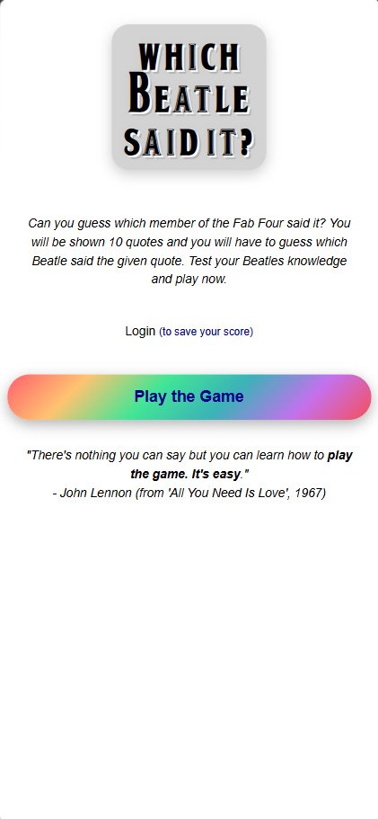

# Which Beatle Said It? 🎸

A full-stack trivia game where players guess which member of The Beatles said famous quotes.

Built with **React**, **Node.js**, **Express**, and **SQLite**.

---

## Features

* 🎵 Beatles quote trivia game
* 👤 User registration and login (JWT authentication)
* 🏆 Personal high score tracking
* 🎲 Randomized quotes every game
* 👥 Guest mode available
* 💾 Scores saved to SQLite database
* 🔐 Secure password hashing with bcrypt

---

## Screenshot

---

## Tech Stack

Frontend

* React
* JavaScript
* CSS

Backend

* Node.js
* Express
* SQLite

Authentication

* JSON Web Tokens (JWT)
* bcrypt

---

## How It Works

1. A user registers or logs in.
2. The game loads 10 random Beatles quotes.
3. The player guesses which Beatle said each quote.
4. The score is calculated.
5. If the score beats the user's previous best, a **new high score** is saved.

Guest users can play the game but their scores are not stored.

---

## Installation

Clone the repository:

git clone https://github.com/topmiljm/which-beatle-said-it.git

Install backend dependencies:

cd backend
npm install

Install frontend dependencies:

cd ../frontend
npm install

---

## Running the App

Start the backend server:

cd backend
node server.js

Start the React app:

cd frontend
npm start

The frontend will run on:

http://localhost:3000

The backend runs on:

http://localhost:5000

---

## Future Improvements

* Global leaderboard
* Difficulty levels
* Timer mode
* More quote categories
* Deployment (Render / Vercel)

---

## Author

James T
Aspiring Software Developer
